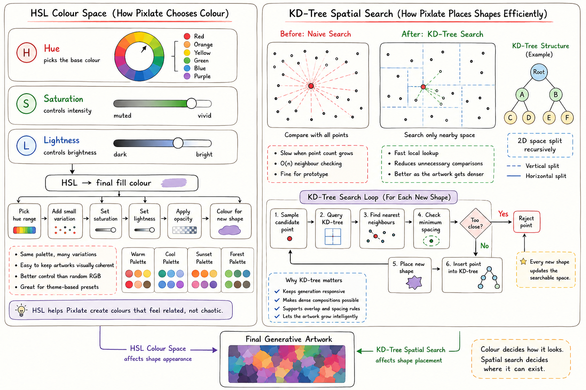

# Pixlate

Pixlate is a generative art project that blends fine-art ideas with code. It builds organic compositions by choosing related colors, placing shapes under spacing constraints, and letting the artwork grow into dense painterly patterns.



## How It Works

Pixlate uses HSL color space to keep palettes visually coherent. Hue selects the base color family, saturation controls intensity, and lightness controls brightness, which makes the final fills feel related instead of chaotic.

For placement, Pixlate uses spatial search ideas such as KD-trees. Instead of comparing every new shape against every existing point, the engine can focus on nearby space, reject candidates that are too close, and keep growing the composition efficiently as the canvas gets denser.

## Run Locally

```bash
npm install
npm run dev
```

Open [http://localhost:3000](http://localhost:3000) to view the project.
